# Instructor Demo: CI/CD Using GitHub Actions

In this guide, we will explore how applications are constantly updated and released to the public smoothly and seamlessly: we will revisit GitHub Actions to set up automated continuous deployment of an application to Render. **Continuous deployment (CD)** describes the automated process by which new features and bug fixes are delivered to end users.

CD often accompanies **continuous integration (CI)**, which describes when developers merge all their existing copies of code into a shared branch several times a day. As changes to a repository compound on each other, developers encounter more complications when submitting their work. The **CI/CD pipeline**, then, keeps the codebase up to date and evolving with the developers that work on it.

Although this particular guide covers continuous deployment with Render, you can use the same process for other platforms, such as Netlify, Vercel, and many others. There is no shortage of cloud providers that you can choose from to deploy your applications -- and because technologies are constantly emerging and evolving, developers need to be well-rounded and adaptable to new platforms.


## Create a Render App

The Render dashboard allows us to easily create an app and link an existing GitHub repository to it to deploy. By default Render will have continuous deployment enabled via automated deploys. First, we will connect our app to Render and show how this functionality works, then we will disable automated deploys and show a more customized version using GitHub actions.

1. Create a new Render app by clicking the "New" button on the right side of the navbar, as shown in the following image:

    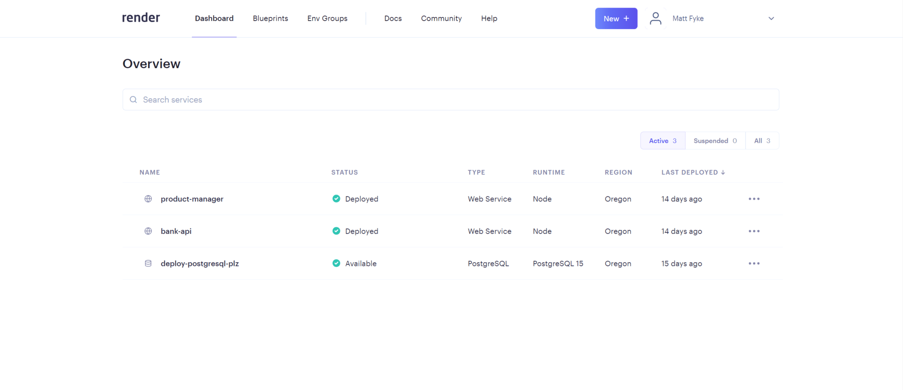

2. Select "Static Site" from the dropdown menu, as shown in the following image:

    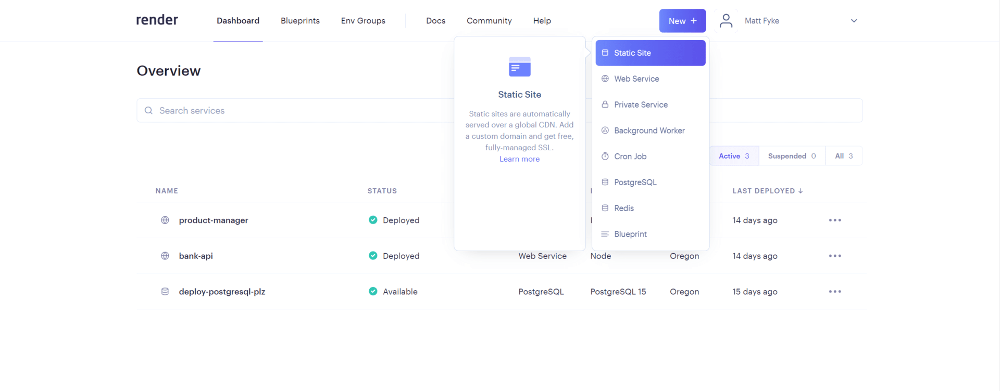

3. Search for your GitHub repository to connect to and click the "Connect" button once you have found it, as shown in the following image:

    

4. If this is your first time deploying to Render, you will need to allow access to your GitHub repositories. Click on the "+ Connect account" link under the GitHub heading, as shown in the following image:

    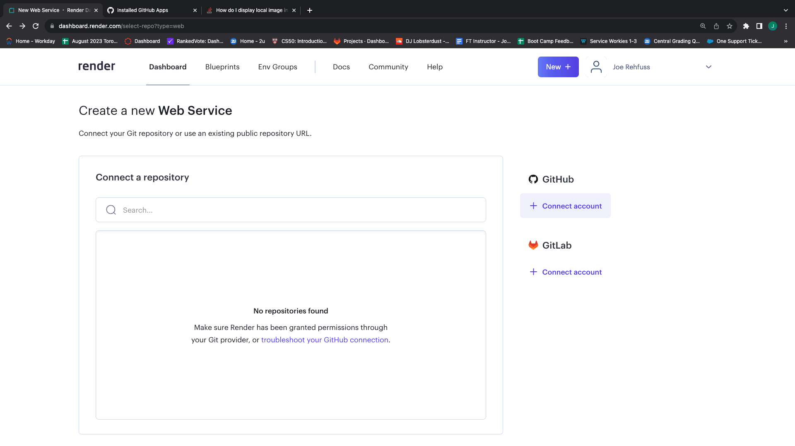

5. Next, install Render to your GitHub account, providing access to all of your repositories, as shown in the following image:

    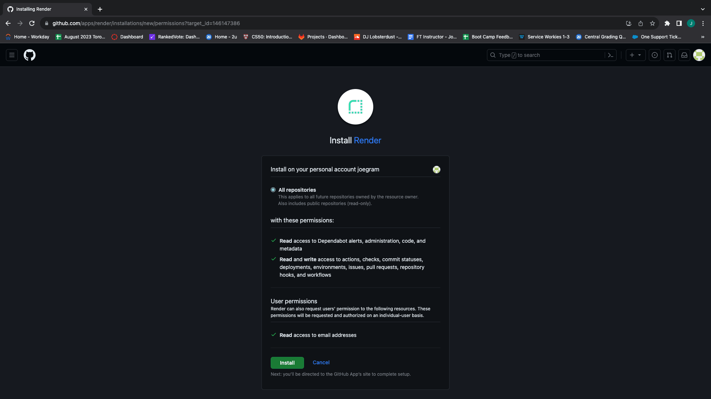

6. You will now be able to search for and connect to your GitHub repository as shown previously.

7. Give your new Render app a unique name, as shown in the following image. It does not have to match the repo name, but it is useful to do so to keep track of which app is attached to which repo:

    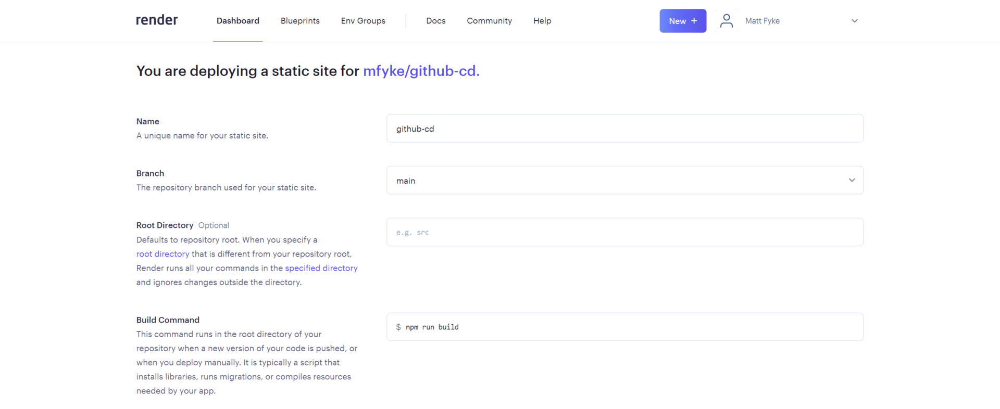

8. Render needs to know which steps need to be taken to get your app up and running. In the case of a static React app, we need to run `npm run build` to build and compile our resources. Scroll to the section "Build Command" and update the field to `npm run build`. Render also needs to know which directory to publish after the build has taken place. By default, render will create a build repository called `dist`, so update this value to be `dist`:

    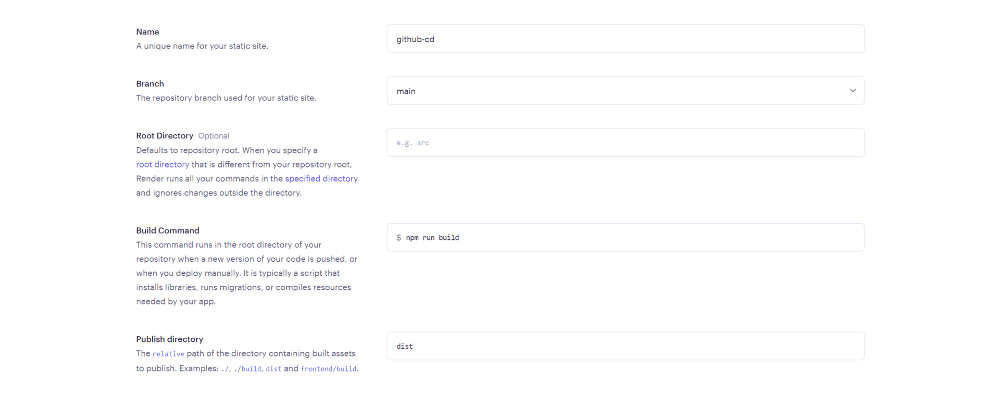

9. Next, click the "Create Static Site" button, as shown in the following image:

    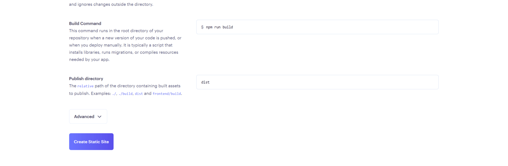

10. The next page will log all the actions being taken to set up your server. Once your server goes live, you can use the provided link toward the top of the page to view your live site, as shown in the following image:

    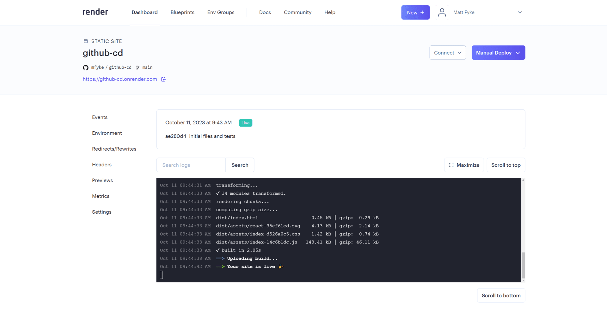

11. Click on "Settings" from the menu on the left of the page, and scroll down in the "Build & Deploy" section below the publish directory and notice the setting for "Auto-Deploy" is on by default:

    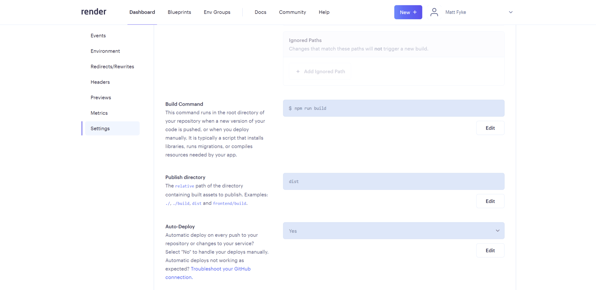

12. To test out the Auto-deploy feature, make a change to the h1 tag of your document and then add, commit and push this change to tracked branch (main by default). Once you have done this, you can see the re-deploy take place in the event log:

    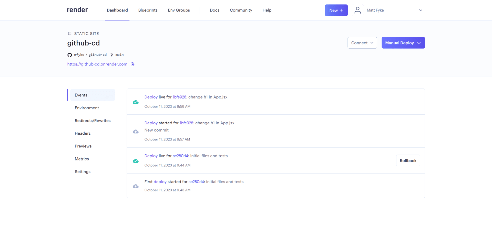

Great, we now have a working continuous deployment configuration!

## Create deploy.yml

1. Navigate to your `.github/workflows` folder. After this, we will create the `deploy.yml` file, defining the workflow for GitHub. 

2. In your code editor, open `.github/workflows/deploy.yml` and add the following content:

    ```yml
    name: Deploy

    on:
        push:
        branches: [main]
        pull_request:
        branches:
            - main
        
    jobs:
        ci:
        runs-on: ubuntu-latest
        steps:
            - uses: actions/checkout@v3

            - name: Test
            run: |
                npm install
                npm run test

            - name: Deploy
            if: github.ref == 'refs/heads/main'
            env:
                DEPLOY_URL: ${{ secrets.RENDER_DEPLOY_HOOK_URL }}
            run: |
                curl "$DEPLOY_URL"
    ```

    * **yml** is a human-readable language intended for config files that are used with programs that store or transmit data. Think of yml, or **YAML**, as a more readable version of XML or JSON.

    * The first part of the file tells GitHub that when a push or pull request to the branch (`main`) occurs, some work should be performed. Update the word `main` in the following code if your default branch name is different:

      ```yml
      on:
        push:
        branches: [main]
        pull_request:
        branches:
            - main
      ```

    * The latter half of this file tells GitHub that the action should be run on a container using the latest version of Ubuntu, a popular Linux distribution. A **container** is a virtual machine that runs on a server either locally or remotely. In this case, the container is being hosted by GitHub. Refer to the following example:

      ```yml
      jobs:
        ci:
          runs-on: ubuntu-latest
      ```

    * The `deploy.yml` file also specifies some actions, to check out the `main` branch and to deploy to Render. The steps are then defined as Test and Deploy.  In the first step Test will install the necessary dependencies and run the tests. In the second Deploy step the deploy will be run using our Render deploy hook URL:

      ```yml
          steps:
            - uses: actions/checkout@v3
            
            - name: Test
            run: |
                npm install
                npm run test

            - name: Deploy

            if: github.ref == 'refs/heads/main'
            env:
                DEPLOY_URL: ${{ secrets.RENDER_DEPLOY_HOOK_URL }}
            run: |
                curl "$DEPLOY_URL"
      ```

    * You can specify multiple workflows that get triggered by different events on different branches as well.

## Render Steps

Now we need to turn off auto-deploys so that our workflow will handle deploys. Then, we need to retrieve our deploy hook from our existing Render application to add to GitHub.

1. First, navigate to the Render application that you have previously created. Once there, go to the settings tab and scroll to the "Auto-Deploy" option. Make sure that this option is set to "No". To do so, click the "Edit" button, select "No" from the dropdown menu, and click the "Save Changes" button, as shown in the following:

    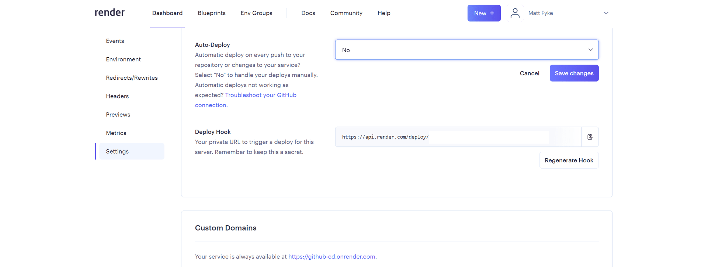

2. Next, scroll down to the "Deploy Hook" option immediately below the "Auto-Deploy" option and copy the value of the deploy hook URL by clicking the clipboard icon. We will need to paste this value into our GitHub settings.

## GitHub Steps

1. Navigate to the repository on GitHub and then select Settings for the repository (not your account settings).

2. Select Secrets and variables from the menu on the left, and then click on Actions in the sub-menu, as shown in the following image:

    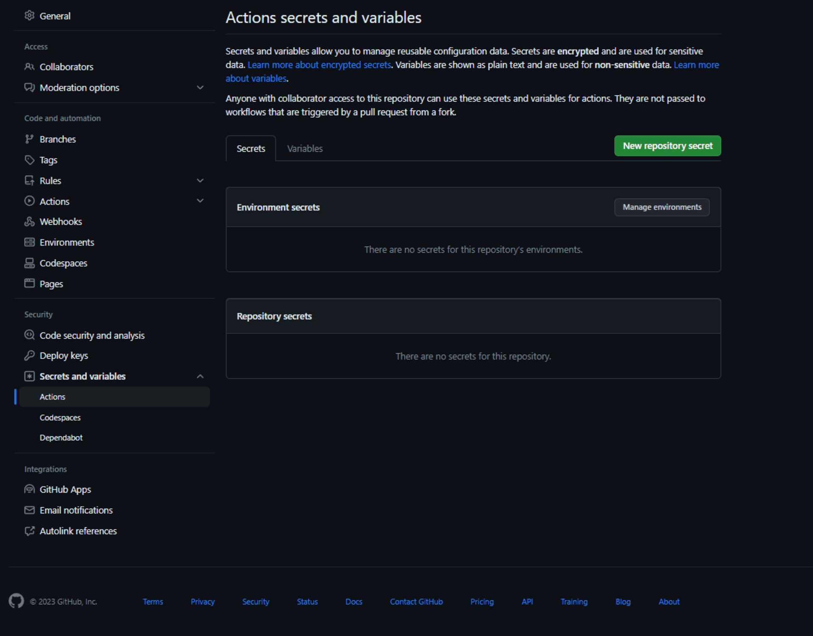

3. Select "New Repository Secret". Name the new secret "RENDER_DEPLOY_HOOK_URL" and then paste in the URL that you copied earlier from Render, as shown in the following image:

    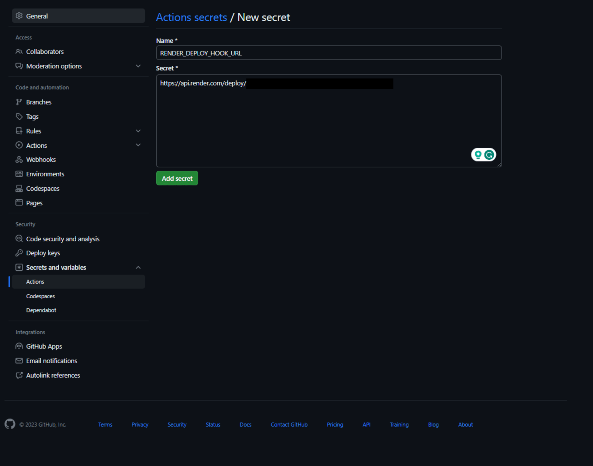

## Finishing Up

* Once you save your secret, the workflow setup should be complete and we just need to test it.

* Frst, we need to add and commit the current changes and push to GitHub. Once we do this, we should see the workflow invoked.

* Create a new feature branch and commit your changes, as follows:

    ```sh
    git checkout -b feature/deployment
    git add -A
    git commit -m "Deploy to render"
    git push origin feature/deployment
    ```
* Approve the PR and base it against the `main` branch, triggering the `Deploy` workflow.

* You can also see in the Render event log that a deploy was triggered:

    

## Conclusion

Congratulations on setting up continuous deployment for your app! It is important to understand how to set up workflows for both your group projects and your future job -- and it can be quite satisfying to push your code to the `main` branch and watch the deployment log on GitHub. Happy coding!

## Helpful Resources

* [YAML documentation](https://yaml.org/)

* [GitHub documentation on continuous integration](https://docs.github.com/en/actions/guides/about-continuous-integration) 

* [GitHub documentation on GitHub Actions](https://docs.github.com/en/actions)

* [Render documentation on deploy hooks](https://render.com/docs/deploy-hooks)

---
© 2024 edX Boot Camps LLC. Confidential and Proprietary. All Rights Reserved.
